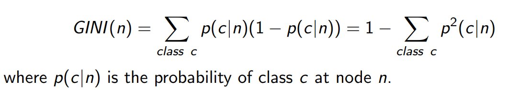

# 1 Quel est le shéma représentant un arbre binaire:
- Un schéma avec un rond au milieu
- Un autre schéma  bizarre coupé pas droit
- Un schéma comme ca :  (vrai?)
# 2 La principle de réduire la profondeur d'un arbre :
-Avoid overfitting (vrai?)
# 3 Quel abre de décision corresponds ce  graphe?
- Une graphe genre: 
- 4 différents abres genre: 
# 4 Caculer Gini donnant la formule: 
Total 30 donnees dont 15 class 1, 0 class 2 et 15 class 3
- 0.75
- 0.5
- les autres mais j'ai oublié :v
# 5 Qu'est ce qui fait qu'un noeud est de bonne qualité ? Indice de gini: 
- faible
- haut? 
- rien