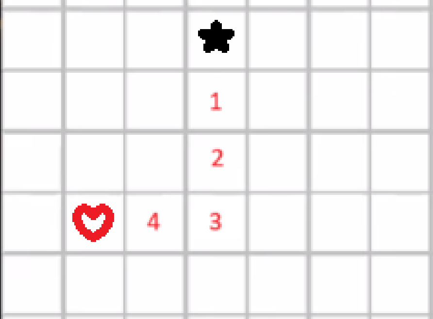
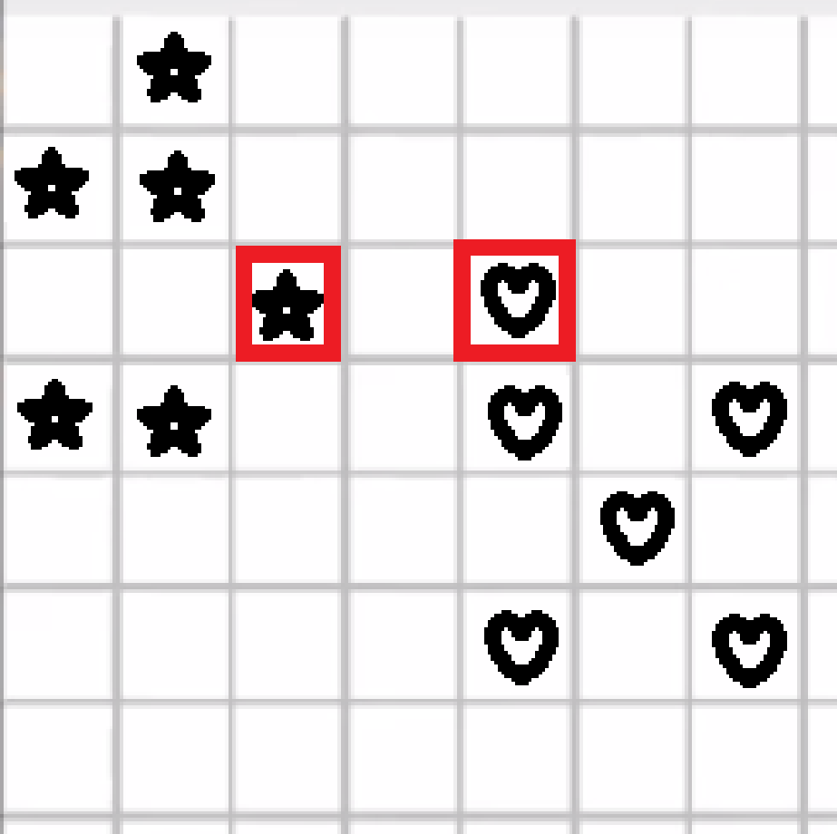
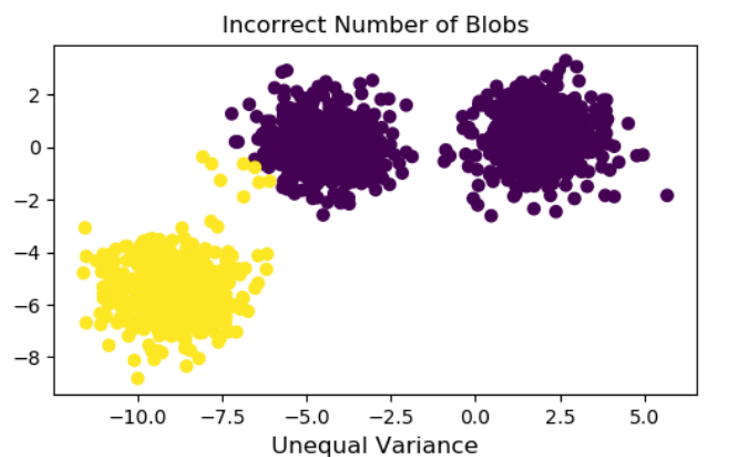
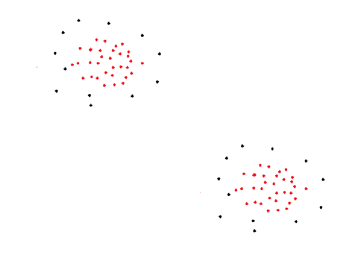

# 1. Calculate Manhatan distance between 2 points
Caro board image
Manhatan : caculate number of steps min+1

-> 4 + 1 = 5
# 2. Giving an image of algo using K-means. With 2 k-means points chosen. And with 1 given point, which cluster (between the 2 k-means points) would it belong to?
Choose the closest one 

# 3. Calculate single linkage with Manhatan distance 
Having image on a caro board with 2 differents blobs of star and diamonds
-> Calculate the distance between the 2 nearest star and diamond

-> 2

# 4. Nombre de calcul de distance entre 2 points à faire pour trouver la réponse à la Q3
-> nb of star x nb diamonds -> 6*6=36

# 5. Giving ian image, which is the clustering algo used?
Some image like this: 
-> K-means

# 6. How to make it better?
-> imposter (makes k=3)

# 5.1 The same as 5. but another image

-> DB Algo

# 6.1. How to make it better?
- Jsp :v
  
# 7. Giving 4 images of clustering, which ones are correct? Or none?
-> None
