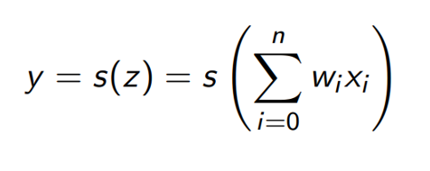
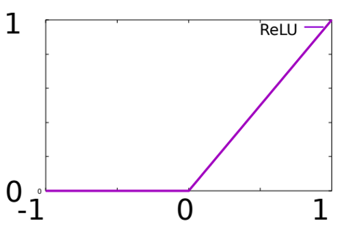
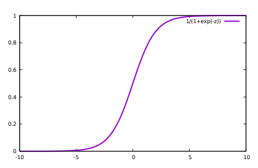

# 1. How to calculate y in neural network

# 2. Which one is diagram of RELU? 

# 2.1 Which one is diagram of sigmoid? 

# 3. Le problème avec (x,y) et on veut dans (c,v,z) combien de neurones en entrée
- 2 entrée (x,y)
# 4. How many hidden layers needed for #3?
- We dont know, need testing
# 5. How many neuronnes for output #3?
- 3 (c,v,z)
  
# 3.1 Having position (longtitude, latitude) -> calcul temperature et son ecart type, something with son ecart-type
- 2 entrée longtitude, latitude
# 4.1 How many hidden layers needed for #3?
- We dont know, need testing
# 5.1 
- 4 (temperature et son ecart type, something with son ecart-type)

# 6. Learning neural network meaning 
- determine weight of each neuronne (poids)
  
# 7. What can we use as loss function? (Krysto a skip)
- median error something

# 8. Order of gradient descent 
- output -> input
  
# 8.1 Order of Prévision (prediction?)
- input->output

# 9. epoch: having 400 with minibatch 40, how many iterations per epoch do we need?
- 10 (good answer: 400/40) 
